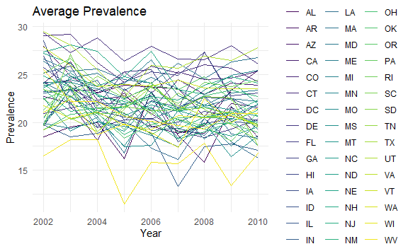
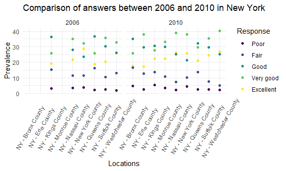
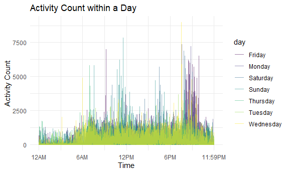

P8105\_hw3\_qh2251
================
Paulina Han
2021/10/14

``` r
library(tidyverse)
```

    ## -- Attaching packages --------------------------------------- tidyverse 1.3.1 --

    ## v ggplot2 3.3.5     v purrr   0.3.4
    ## v tibble  3.1.4     v dplyr   1.0.7
    ## v tidyr   1.1.3     v stringr 1.4.0
    ## v readr   2.0.1     v forcats 0.5.1

    ## -- Conflicts ------------------------------------------ tidyverse_conflicts() --
    ## x dplyr::filter() masks stats::filter()
    ## x dplyr::lag()    masks stats::lag()

``` r
library(p8105.datasets)
library(leaflet)

knitr::opts_chunk$set(
  fig.width = 6,
  fig.asp = .6,
  out.width = "90%"
)
theme_set(theme_minimal() + theme(legend.position = "bottom"))
options(
  ggplot2.continuous.colour = "viridis",
  ggplot2.continuous.fill = "viridis"
)
scale_colour_discrete = scale_color_viridis_d
scale_fill_discrete = scale_fill_viridis_d
```

# Problem 1

``` r
#load the data
data("instacart")

#illustrate
head(instacart,8)
```

    ## # A tibble: 8 x 15
    ##   order_id product_id add_to_cart_order reordered user_id eval_set order_number
    ##      <int>      <int>             <int>     <int>   <int> <chr>           <int>
    ## 1        1      49302                 1         1  112108 train               4
    ## 2        1      11109                 2         1  112108 train               4
    ## 3        1      10246                 3         0  112108 train               4
    ## 4        1      49683                 4         0  112108 train               4
    ## 5        1      43633                 5         1  112108 train               4
    ## 6        1      13176                 6         0  112108 train               4
    ## 7        1      47209                 7         0  112108 train               4
    ## 8        1      22035                 8         1  112108 train               4
    ## # ... with 8 more variables: order_dow <int>, order_hour_of_day <int>,
    ## #   days_since_prior_order <int>, product_name <chr>, aisle_id <int>,
    ## #   department_id <int>, aisle <chr>, department <chr>

This instacart data set includes 1384617 observations and 15 variables.
This data set includes the online shopping history in 2017. Some of the
important varibales are `user_id` which is a identifier of
customer,`product_name` is the name of their ordered product and `aisle`
is where the product placed.For example this is the detail of the order
with order id 1.

``` r
# summary the aisles
 aisels_df1 = 
   instacart %>% 
  group_by(aisle) %>% 
  summarize(num = n()) %>% 
   arrange(desc(num))

# plotting the aisles and their sales
 aisels_df2 =   
  instacart %>% 
  group_by(aisle) %>% 
  summarize(num = n()) %>% 
    filter(num > 10000) %>% 
    arrange(desc(num))
    
 aisels_df2 %>% 
   mutate(
     aisle = factor(aisle),
     aisle = fct_reorder(aisle, num)
   ) %>% 
 ggplot(aes(x = aisle, y = num)) + 
  geom_point() + 
  labs(
    title = "Aisle Sale",
    x = "aisles",
    y = "number of item",
    ) +
   theme(axis.text.x=element_text(angle = 90, vjust = 0.5, hjust = 1))
```


``` r
# most popular product in each aisle
 aisels_df3 = 
   instacart %>% 
   filter(aisle %in% c("baking ingredients","dog food care","packaged vegetables fruits")) %>% 
   group_by(aisle, product_name) %>% 
   summarise(order_count = n()) %>% 
   arrange(desc(order_count),.by_group = T) %>% 
   slice_max(order_by = order_count,n = 3)  
```

    ## `summarise()` has grouped output by 'aisle'. You can override using the `.groups` argument.

``` r
#make a table
   aisels_df3 %>% 
    knitr::kable()
```

| aisle                      | product\_name                                 | order\_count |
|:---------------------------|:----------------------------------------------|-------------:|
| baking ingredients         | Light Brown Sugar                             |          499 |
| baking ingredients         | Pure Baking Soda                              |          387 |
| baking ingredients         | Cane Sugar                                    |          336 |
| dog food care              | Snack Sticks Chicken & Rice Recipe Dog Treats |           30 |
| dog food care              | Organix Chicken & Brown Rice Recipe           |           28 |
| dog food care              | Small Dog Biscuits                            |           26 |
| packaged vegetables fruits | Organic Baby Spinach                          |         9784 |
| packaged vegetables fruits | Organic Raspberries                           |         5546 |
| packaged vegetables fruits | Organic Blueberries                           |         4966 |

``` r
# mean hour of the day at which Pink Lady Apples and Coffee Ice Cream are ordered on each day of the week
hour_df = 
  instacart %>% 
  filter(product_name %in% c("Pink Lady Apples","Coffee Ice Cream"))%>% 
  group_by(product_name,order_dow) %>% 
  summarize(mean_order_time = round(mean(order_hour_of_day))) %>% 
  pivot_wider(
    names_from = order_dow,
    values_from = mean_order_time
  ) 
```

    ## `summarise()` has grouped output by 'product_name'. You can override using the `.groups` argument.

``` r
#rename the colunms
colnames(hour_df) = c("product_name","Sunday","Monday","Tuesday","Wednesday","Thursday","Friday","Saturday")
 
#print table
hour_df %>% 
  knitr::kable()
```

| product\_name    | Sunday | Monday | Tuesday | Wednesday | Thursday | Friday | Saturday |
|:-----------------|-------:|-------:|--------:|----------:|---------:|-------:|---------:|
| Coffee Ice Cream |     14 |     14 |      15 |        15 |       15 |     12 |       14 |
| Pink Lady Apples |     13 |     11 |      12 |        14 |       12 |     13 |       12 |

There are 134 aisles and the *fresh vegetables aisle* is the where most
items are ordered from.

From the plot we can see that fresh vegetables and fresh fruits are the
2 aisles where most items were order from and are way more than any
other aisles.Packaged vegetables and fruits, yogurt,packaged cheese
followed next.

In the “baking ingredients aisles” light brown sugar is ordered the
most. In the “dog food care” aisles Snack Sticks Chicken & Rice Recipe
Dog Treats is ordered the most. In the “packaged fruits and vegetables”
aisle Organic Baby Spinach is ordered th most.

For Coffee Ice-cream, the order is slightly higher during the middle of
the week, from Tuesday to Thursday. Pink Lady Apples are ordered the
most on Wednesday.

# Problem 2

``` r
#load the data
data("brfss_smart2010")

#clean variable names
brfss_smart2010_1=
 brfss_smart2010 %>% 
  rename(
    State = Locationabbr,
    Location = Locationdesc
  )

#subset a new data set brfss_df_1
brfss_df_1 = 
  brfss_smart2010_1 %>% 
  filter(Topic == "Overall Health") %>% 
  filter(Response %in% c("Excellent","Very good","Good","Fair","Poor")) %>% 
  mutate(Response = as.factor(Response)) %>% 
  mutate(Response = factor(Response, levels = c("Poor", "Fair", "Good","Very good","Excellent")))

#In 2002, which states were observed at 7 or more locations? What about in 2010?
#2002
brfss_df_2 = 
  brfss_df_1 %>% 
  filter(Year == 2002) %>% 
  group_by(State) %>%
  summarize(loc_num = n())%>% 
  filter(loc_num >= 7)

#2010
brfss_df_3 = 
  brfss_df_1 %>% 
  filter(Year == 2010) %>% 
  group_by(State) %>%
  summarize(loc_num = n())%>% 
  filter(loc_num >= 7)

#states in 2002
states_2002 = pull(brfss_df_2,State)
#States in 2010
states_2010 = pull(brfss_df_3,State)

#answer only Excellent
brfss_df_4 = 
  brfss_df_1 %>% 
  filter(Response == "Excellent") %>% 
  group_by(Year,State) %>% 
mutate(
  mean_value = mean(Data_value,na.rm = T)) %>% 
  select(Year, State, mean_value) %>% 
  distinct() %>% 
  arrange(Year)
 
#plot
brfss_df_4 %>% 
  ggplot(aes(x = Year, y = mean_value, color = State))+
  geom_line()+
   labs(
    title = "Average Prevalence",
    x = "Year",
    y = "Prevalence",
    )+
  theme(legend.position = "right")
```



``` r
#Make a two-panel plot showing, for the years 2006, and 2010, distribution of data_value for responses (“Poor” to “Excellent”) among locations in NY State
 
brfss_df_5 =
  brfss_df_1 %>% 
  filter(Year %in% c(2006,2010)) %>% 
  filter(State == "NY")

brfss_df_5 %>% 
ggplot(aes(x = Location , y = Data_value, color = Response))+
  geom_point()+
  facet_grid(.~ Year)+
   labs(
    title = "Comparison of answers between 2006 and 2010 in New York",
    x = "Locations",
    y = "Prevalence",
    )+
   theme(axis.text.x=element_text(angle = 60, vjust = 0.5, hjust = 0.5), legend.position = "right")
```



In 2002 AZ, CO, CT, DE, FL, GA, HI, ID, IL, IN, KS, LA, MA, MD, ME, MI,
MN, MO, NC, NE, NH, NJ, NV, NY, OH, OK, OR, PA, RI, SC, SD, TN, TX, UT,
VT, WA were observed in more than 7 locations. In 2010 AL, AR, AZ, CA,
CO, CT, DE, FL, GA, HI, IA, ID, IL, IN, KS, LA, MA, MD, ME, MI, MN, MO,
MS, MT, NC, ND, NE, NH, NJ, NM, NV, NY, OH, OK, OR, PA, RI, SC, SD, TN,
TX, UT, VT, WA, WY were observed in more than 7 locations.

The average prevalence across different locations within a State with
the answer “Excellent” was fluctuating between 20 to 25. And West
Virginia has a extreme low mean in 2005 compared to the other states and
remained low in the following years.

Comparing the prevalence in general between 2010 and 2006, we can see
that most people answered “Very good” or “Good”,only a small amount of
people answered “Poor”. There are slightly more people answered “Very
good” in 2010 than 2006 and the prevalence for other answers stayed
about the same.

# Probelm 3

``` r
ACC_df = read_csv("./homework3_files/accel_data.csv")

ACC_df1 =
  ACC_df %>% 
  janitor::clean_names() %>%
  rename(id = day_id) %>% 
  mutate(weekdays = ifelse(day %in% c("Monday","Tuesday","Wednesday","Thursday","Friday"),1,0)) #weekday=1,weekend=0

obs = nrow(ACC_df1)
col = ncol(ACC_df1)
```

**Description**

There are 35 observation in this data set which represent the days when
the data were collected. There are 1444 variables which includes `week`
variable indicating the number of week and `id` variable indicating the
number of days. The `day` variable represent the week names of the day.
Variable `activity_1` to `activity_1440` indicates the activity counts
in every minute starting from midnight throughout the day. `weekdays`
variable is a binary variable indicating if it is weekend or not by
labeling weekdays as 1 and weekend as 0.

``` r
# activity counts by day

ACC_df2 =
  ACC_df1 %>% 
  mutate(total = rowSums(select(ACC_df1,activity_1:activity_1440))) %>% 
  select(week,id,weekdays,day,total) 

#table
  knitr::kable(ACC_df2)
```

| week |  id | weekdays | day       |     total |
|-----:|----:|---------:|:----------|----------:|
|    1 |   1 |        1 | Friday    | 480542.62 |
|    1 |   2 |        1 | Monday    |  78828.07 |
|    1 |   3 |        0 | Saturday  | 376254.00 |
|    1 |   4 |        0 | Sunday    | 631105.00 |
|    1 |   5 |        1 | Thursday  | 355923.64 |
|    1 |   6 |        1 | Tuesday   | 307094.24 |
|    1 |   7 |        1 | Wednesday | 340115.01 |
|    2 |   8 |        1 | Friday    | 568839.00 |
|    2 |   9 |        1 | Monday    | 295431.00 |
|    2 |  10 |        0 | Saturday  | 607175.00 |
|    2 |  11 |        0 | Sunday    | 422018.00 |
|    2 |  12 |        1 | Thursday  | 474048.00 |
|    2 |  13 |        1 | Tuesday   | 423245.00 |
|    2 |  14 |        1 | Wednesday | 440962.00 |
|    3 |  15 |        1 | Friday    | 467420.00 |
|    3 |  16 |        1 | Monday    | 685910.00 |
|    3 |  17 |        0 | Saturday  | 382928.00 |
|    3 |  18 |        0 | Sunday    | 467052.00 |
|    3 |  19 |        1 | Thursday  | 371230.00 |
|    3 |  20 |        1 | Tuesday   | 381507.00 |
|    3 |  21 |        1 | Wednesday | 468869.00 |
|    4 |  22 |        1 | Friday    | 154049.00 |
|    4 |  23 |        1 | Monday    | 409450.00 |
|    4 |  24 |        0 | Saturday  |   1440.00 |
|    4 |  25 |        0 | Sunday    | 260617.00 |
|    4 |  26 |        1 | Thursday  | 340291.00 |
|    4 |  27 |        1 | Tuesday   | 319568.00 |
|    4 |  28 |        1 | Wednesday | 434460.00 |
|    5 |  29 |        1 | Friday    | 620860.00 |
|    5 |  30 |        1 | Monday    | 389080.00 |
|    5 |  31 |        0 | Saturday  |   1440.00 |
|    5 |  32 |        0 | Sunday    | 138421.00 |
|    5 |  33 |        1 | Thursday  | 549658.00 |
|    5 |  34 |        1 | Tuesday   | 367824.00 |
|    5 |  35 |        1 | Wednesday | 445366.00 |

There aren’t any apparent trend we can see from this table.But we can
see 2 Saturdays with extreme low activity count.

``` r
#plot #x-labels

Activity = 
  ACC_df1 %>% 
  select(day,activity_1:activity_1440) %>% 
 pivot_longer(
   activity_1:activity_1440,
   names_to = "time",
   names_prefix = "activity_",
   values_to = "count"
 ) %>% 
  mutate(time = as.numeric(time))


Activity %>% 
ggplot(aes( x = time, y = count, color = day))+ 
  geom_line(alpha = 0.5)+ labs(
    title = "Activity Count within a Day ",
    x = "Time",
    y = "Activity Count",
    )+
  theme(legend.position = "right")+
  scale_x_continuous(
    breaks = c(1,360,720,1080,1440),
    labels = c("12AM", "6AM", "12PM", "6PM", "11:59PM")
    )
```



We can see that the activity count in every minute throughout the day is
usually below 2500. The activity count at noon and evenings tends to
peak compared to the other time of the day.
