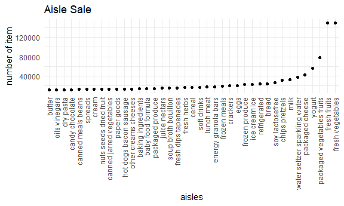

P8105\_hw3\_qh2251
================
Paulina Han
2021/10/14

``` r
library(tidyverse)
```

    ## -- Attaching packages --------------------------------------- tidyverse 1.3.1 --

    ## v ggplot2 3.3.5     v purrr   0.3.4
    ## v tibble  3.1.4     v dplyr   1.0.7
    ## v tidyr   1.1.3     v stringr 1.4.0
    ## v readr   2.0.1     v forcats 0.5.1

    ## -- Conflicts ------------------------------------------ tidyverse_conflicts() --
    ## x dplyr::filter() masks stats::filter()
    ## x dplyr::lag()    masks stats::lag()

``` r
library(p8105.datasets)
library(leaflet)

knitr::opts_chunk$set(
  fig.width = 6,
  fig.asp = .6,
  out.width = "90%"
)
theme_set(theme_minimal() + theme(legend.position = "bottom"))
options(
  ggplot2.continuous.colour = "viridis",
  ggplot2.continuous.fill = "viridis"
)
scale_colour_discrete = scale_color_viridis_d
scale_fill_discrete = scale_fill_viridis_d
```

# Problem 1

``` r
#load the data
data("instacart")

# summary the aisles
 aisels_df1 = 
   instacart %>% 
  group_by(aisle) %>% 
  summarize(num = n()) %>% 
   arrange(desc(num))

# plotting the aisles and their sales
 aisels_df2 =   
  instacart %>% 
  group_by(aisle) %>% 
  summarize(num = n()) %>% 
    filter(num > 10000) %>% 
    arrange(desc(num))
    
 aisels_df2 %>% 
 ggplot(aes(x = aisle, y = num)) + 
  geom_point() + 
  labs(
    title = "Aisle Sale",
    x = "aisles",
    y = "number of item",
    ) +
    geom_text(label = pull(aisels_df2, aisle), nudge_x = 0.25, nudge_y = 0.25, check_overlap = T)+
   theme(axis.text.x=element_blank())
```



``` r
# most popular product in each aisle
 aisels_df3 = 
   instacart %>% 
   filter(aisle %in% c("baking ingredients","dog food care","packaged vegetables fruits")) %>% 
   group_by(aisle, product_name) %>% 
   summarise(product_num = n()) %>% 
   arrange(desc(product_num),.by_group = T) %>% 
   slice_max(order_by = product_num,n = 3)  
```

    ## `summarise()` has grouped output by 'aisle'. You can override using the `.groups` argument.

``` r
#make a table
   aisels_df3 %>% 
    knitr::kable()
```

| aisle                      | product\_name                                 | product\_num |
|:---------------------------|:----------------------------------------------|-------------:|
| baking ingredients         | Light Brown Sugar                             |          499 |
| baking ingredients         | Pure Baking Soda                              |          387 |
| baking ingredients         | Cane Sugar                                    |          336 |
| dog food care              | Snack Sticks Chicken & Rice Recipe Dog Treats |           30 |
| dog food care              | Organix Chicken & Brown Rice Recipe           |           28 |
| dog food care              | Small Dog Biscuits                            |           26 |
| packaged vegetables fruits | Organic Baby Spinach                          |         9784 |
| packaged vegetables fruits | Organic Raspberries                           |         5546 |
| packaged vegetables fruits | Organic Blueberries                           |         4966 |

``` r
# mean hour of the day at which Pink Lady Apples and Coffee Ice Cream are ordered on each day of the week
hour_df = 
  instacart %>% 
  filter(product_name %in% c("Pink Lady Apples","Coffee Ice Cream"))%>% 
  group_by(product_name,order_dow) %>% 
  summarize(mean_order_time = round(mean(order_hour_of_day),2)) %>% 
  pivot_wider(
    names_from = order_dow,
    values_from = mean_order_time
  ) 
```

    ## `summarise()` has grouped output by 'product_name'. You can override using the `.groups` argument.

``` r
#rename the colunms
colnames(hour_df) = c("product_name","Sunday","Monday","Tuesday","Wednesday","Thursday","Friday","Saturday")
 
#print table
hour_df %>% 
  knitr::kable()
```

| product\_name    | Sunday | Monday | Tuesday | Wednesday | Thursday | Friday | Saturday |
|:-----------------|-------:|-------:|--------:|----------:|---------:|-------:|---------:|
| Coffee Ice Cream |  13.77 |  14.32 |   15.38 |     15.32 |    15.22 |  12.26 |    13.83 |
| Pink Lady Apples |  13.44 |  11.36 |   11.70 |     14.25 |    11.55 |  12.78 |    11.94 |

There are 134 aisles and the fresh vegetables aisle is the where most
items are ordered from.
